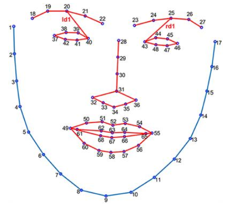
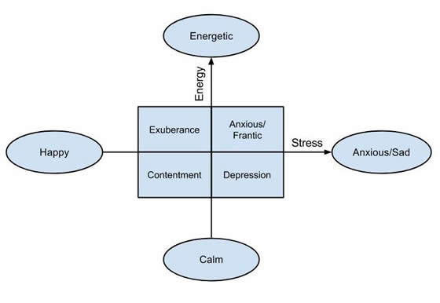
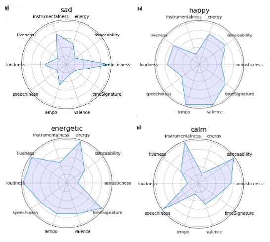
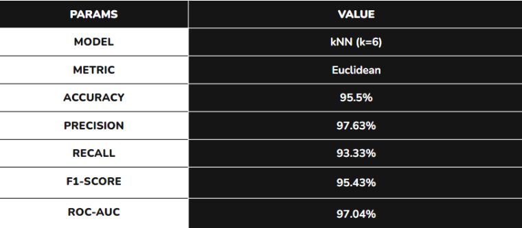

<p align="center" id="top">
  
</p>
<p align="center">
    <h1 align="center">coDestress | PeakJourney @ 2024</h1>
</p>
<p align="center">
    <em>coDestress is an everyday app that empowers you to heal and lifts your mood through music therapy.</em>
</p>
<p align="center">
	
	
	
</p>

<br><!-- TABLE OF CONTENTS -->
<details>
  <summary>Table of Contents</summary><br>

- [Features](#features)
- [Project Overview](#project-overview)
- [File Descriptions](#file-descriptions)
- [Design Choices](#design-choices)
- [Getting Started](#getting-started)
- [Contributing](#contributing)
- [Copyright](#copyright)
  - [Copyright Notice](#copyright-notice)
</details>

---

##  Features

<ul>
<li>User Authentication and Authorization</li>
<li>Music Recommendation Engine based on your own preferences and moods (energetic, happy, sad, depressed)</li>
<li>User Profile Management, including Favorite Artists and Genres</li>
<li>Auto-play music based on your mood in real time (Spotify Music API)
<li>Track your mental health pattern in the latest 7 days</li>
<li>Mental Therapy AI Chatbot</li>
</ul>

---

## Project Overview

<p>
<kbd></kbd>

<kbd></kbd>

<kbd></kbd>

<kbd></kbd>
</p>

The project consists of multiple files and directories, each serving a specific purpose in the overall architecture of the platform. The main directory contains the following subdirectories:

* **StressAPI**: This directory contains the core application files, including the custom music player, API integrations, and user interface components.
* **server**: This directory contains the server-side code, including API routes, database models, and authentication logic.
* **static**: This directory contains static assets, such as images, CSS files, and JavaScript files.
* **templates**: This directory contains HTML templates for the user interface components.

## File Descriptions

* **manage.py**: This file contains the application's entry point, responsible for initializing the Django framework and loading the application's configuration.
* **settings.py**: This file contains the application's configuration settings, including database connections, API keys, and authentication settings.
* **urls.py**: This file defines the URL routes for the application, mapping URLs to specific views and API endpoints.
* **wsgi.py**: This file contains the WSGI application object, responsible for serving the application over the web.
* **models.py**: This file defines the database models for the application, including user profiles, music tracks, and playlists.
* **views.py**: This file contains the application's views, responsible for handling HTTP requests and returning responses.
* **forms.py**: This file defines the application's forms, used for user input validation and data processing.
* **templates/index.html**: This file contains the landing page.
* **templates/analysis.html**: This file contains the main web app.
* **static/css/style.css**: This file contains the application's CSS styles, defining the visual layout and design.
* **static/js/script.js**: This file contains the application's JavaScript code, responsible for handling user interactions and API requests.

> [!NOTE] 
> There are more files but I cannot list all of them here due to the time limit
---

## Design Choices

During the development of coDestress, several design choices were debated and carefully considered. Some of the most significant decisions include:

* The choice of using the Spotify Web API and iframe API to power the music streaming functionality, leveraging the existing infrastructure and expertise of Spotify to provide a seamless user experience.
* The use of Django as the web framework, due to its robustness, scalability, and ease of use. Django's built-in authentication and authorization system was particularly useful in implementing user authentication and access control.
* The use of AJAX for asynchronous requests to the Spotify API, allowing for seamless searching and music playback.
* The use of jQuery for DOM manipulation and event handling, providing a responsive and interactive user interface.
* The use of HTMX for handling search requests, providing a fast and efficient way to retrieve search results from the Spotify API.
* The use of poe-api-wrapper (made by one member of our team [@snowby666](https://github.com/snowby666/poe-api-wrapper)) for AI Chatbot integration
* The use of MVT (Model-View-Template) architecture, which separates the application logic into three interconnected components:
	+ **Model**: Represents the data and business logic of the application, encapsulating the database models and API integrations.
	+ **View**: Handles HTTP requests and returns responses, interacting with the model to retrieve and manipulate data.
	+ **Template**: Defines the user interface components, using the data provided by the view to render the HTML templates.

---

##  Getting Started

**System Requirements:**

* **Python**: `version 3.9+`
  
To get started with this project, follow these steps:

- Clone the repository: 
```ShellSession
git clone https://github.com/snowby666/SASEHACK-2024
```
- Change to the project directory: 
```ShellSession
cd SASEHACK-2024
```
- Install the dependencies: 
```ShellSession
pip install -r requirements.txt
```
- Install `dlib` library (this is a headache for us because of the compatibility issue)
- Find the most compatible version [here](https://github.com/sachadee/Dlib)
```ShellSession
python -m pip install dlib-19.22.99-cp39-cp39-win_amd64.whl
```
- Run the development server: 
```ShellSession
daphne StressAPI.asgi:application -b 127.0.0.1 -p 8000
```
---

##  Contributing

Contributions are welcome! Here are several ways you can contribute:

- **[Report Issues](https://github.com/snowby666/SASEHACK-2024/issues)**: Submit bugs found or log feature requests for the `SASEHACK-2024` project.
- **[Submit Pull Requests](https://github.com/snowby666/SASEHACK-2024/blob/main/CONTRIBUTING.md)**: Review open PRs, and submit your own PRs.
- **[Join the Discussions](https://github.com/snowby666/SASEHACK-2024/discussions)**: Share your insights, provide feedback, or ask questions.

<details closed>
<summary>Contributing Guidelines</summary>

1. **Fork the Repository**: Start by forking the project repository to your github account.
2. **Clone Locally**: Clone the forked repository to your local machine using a git client.
   
   ```ShellSession
   git clone https://github.com/snowby666/SASEHACK-2024
   ```
3. **Create a New Branch**: Always work on a new branch, giving it a descriptive name.
   
   ```ShellSession
   git checkout -b new-feature-x
   ```
4. **Make Your Changes**: Develop and test your changes locally.
5. **Commit Your Changes**: Commit with a clear message describing your updates.
   
   ```ShellSession
   git commit -m 'Implemented new feature x.'
   ```
6. **Push to github**: Push the changes to your forked repository.
   
   ```ShellSession
   git push origin new-feature-x
   ```
7.  **Submit a Pull Request**: Create a PR against the original project repository. Clearly describe the changes and their motivations.
8.  **Review**: Once your PR is reviewed and approved, it will be merged into the main branch. Congratulations on your contribution!
</details>

<details closed>
<summary>Contributor Graph</summary>
<br>
<p align="center">
   <a href="https://github.com{/snowby666/SASEHACK-2024/}graphs/contributors">
      
   </a>
</p>
</details>

---

## Copyright
This program is licensed under the [GNU GPL v3](https://github.com/snowby666/SASEHACK-2024/blob/main/LICENSE). All code has been written by me, [snowby666](https://github.com/snowby666).

### Copyright Notice
```
snowby666/SASEHACK-2024: coDestress
Copyright (C) 2024 snowby666

This program is free software: you can redistribute it and/or modify
it under the terms of the GNU General Public License as published by
the Free Software Foundation, either version 3 of the License, or
(at your option) any later version.

This program is distributed in the hope that it will be useful,
but WITHOUT ANY WARRANTY; without even the implied warranty of
MERCHANTABILITY or FITNESS FOR A PARTICULAR PURPOSE.  See the
GNU General Public License for more details.

You should have received a copy of the GNU General Public License
along with this program.  If not, see <https://www.gnu.org/licenses/>.
```

---

[**Return**](#top)

---
